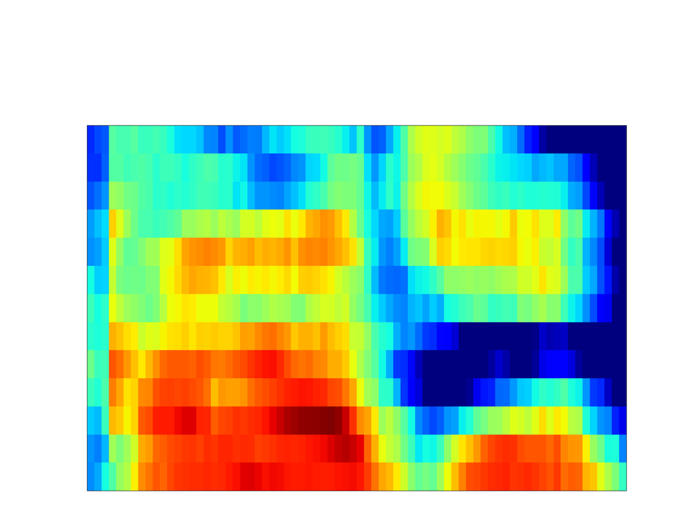
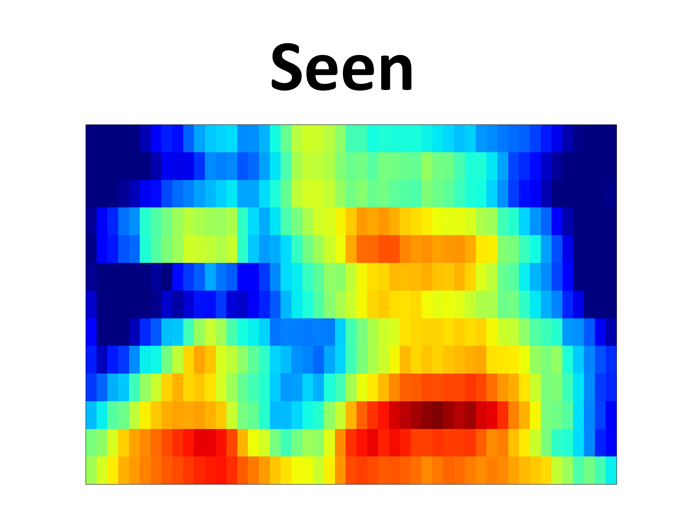
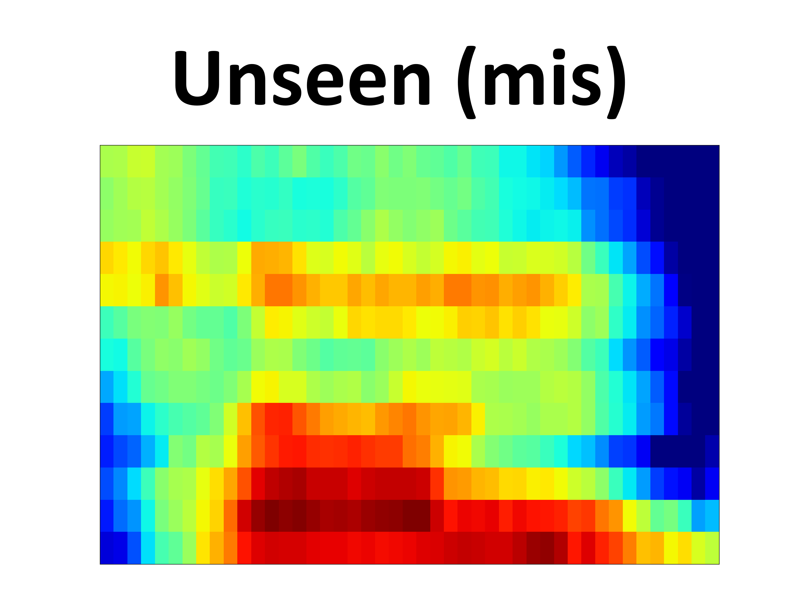
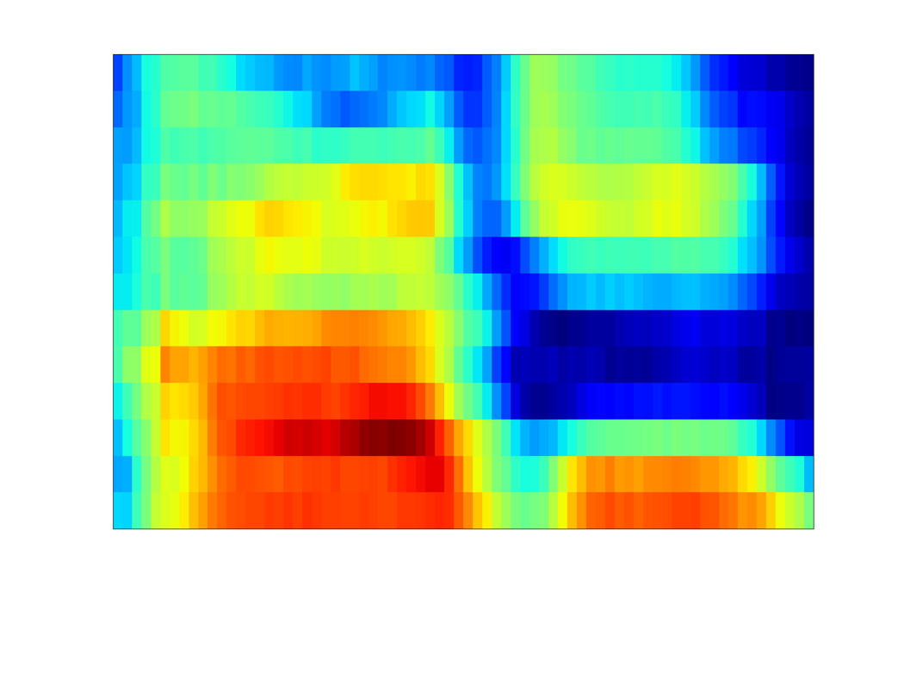
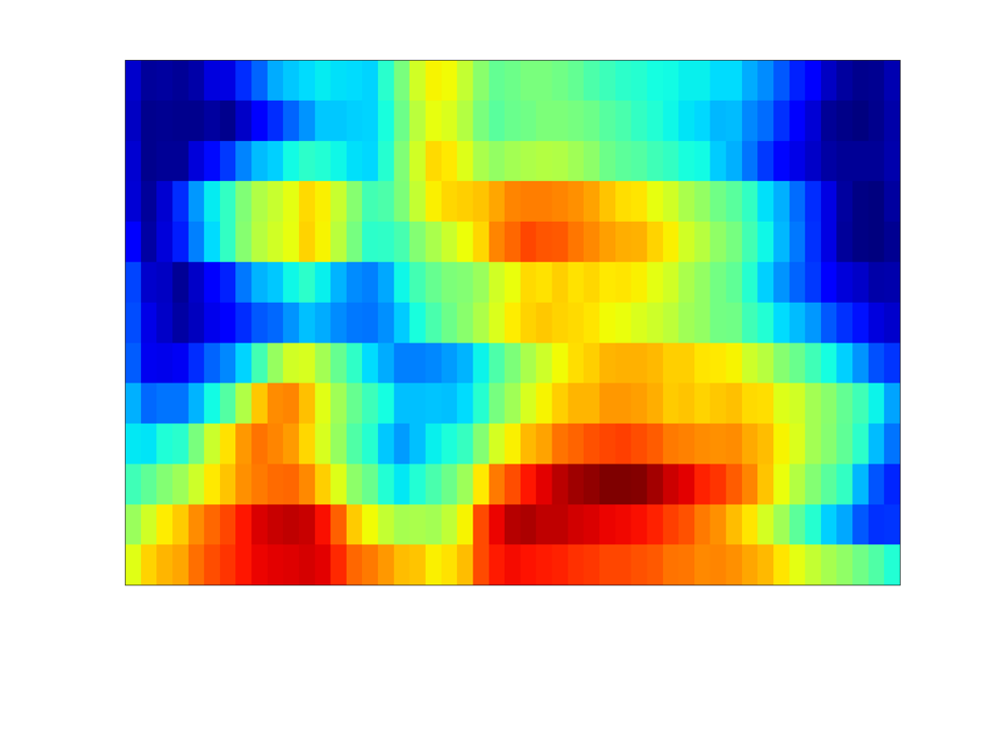
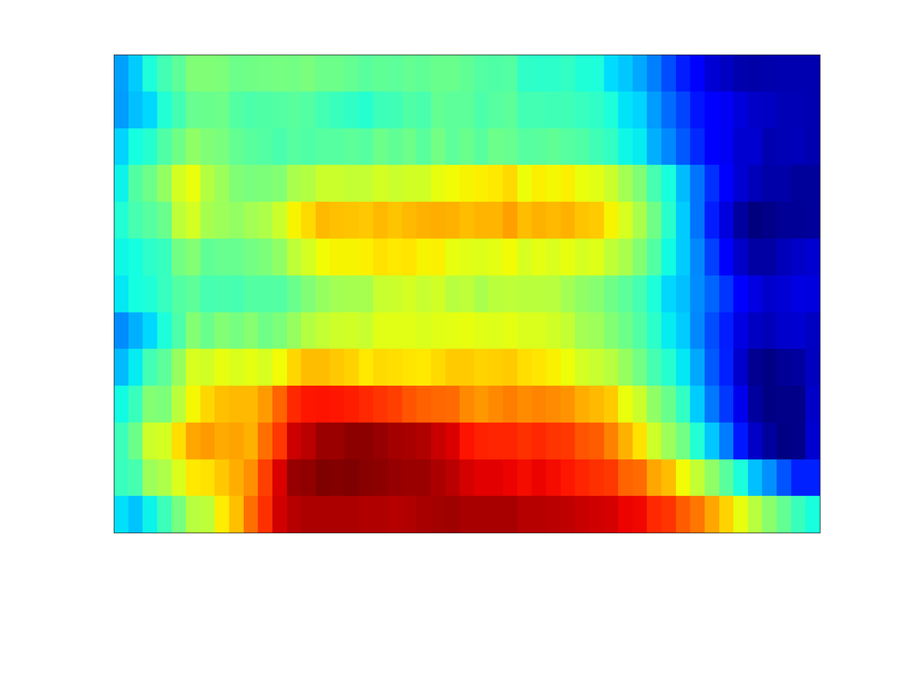
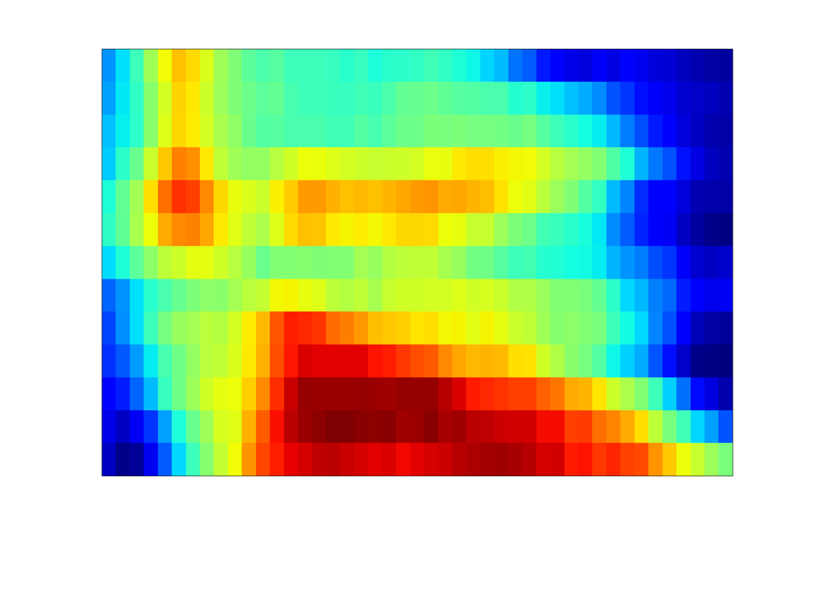

<h2> BrainTalker: Low-Resource Brain-to-Speech Synthesis with Transfer Learning using Wav2Vec 2.0
</h2>

Submitted to INTERSPEECH 2023 (Paper ID: 2233)

<h3>Authors
</h3>
Anonymous submission

<h3>Github code
</h3>
https://braintalker.github.io

 

<h3>Proposed Method</h3>

In this paper, we propose BrainTalker – a novel brainto-speech synthesis framework that generates intelligible spoken speech from electrocorticography (ECoG) signals under an
extremely low-resource scenario. Despite its high-resolution
strength, ECoG requires a risky surgical procedure that severely
limits the data collection. To solve this problem, we propose
a transfer learning approach that utilizes a pre-trained selfsupervised model Wav2Vec 2.0 and extracts generalized latent
features from the ECoG signals. Also, we introduce context
loss, a novel loss function that reduces the information gap
between the brain and speech representations obtained from
Wav2Vec 2.0 respectively. We feed the extracted representations into a mel generator and synthesize mel spectrograms for
speech waveform generation. Our experimental results show
that BrainTalker can generate natural and intelligible speech in
terms of both subjective and objective metrics. We release the
demo page and code publicly.

 

<h3>Samples (Seen)
</h3>

<table style="width:10; height:10">
    <tr>
        <td>
        	GT Spectrogram
        </td>
        <td class="someting">
            
        </td>
        <td class="someting">
            
        </td>
        <td class="someting">
            
        </td>
        <td class="someting">
            
        </td>
    </tr>
    <tr>
        <td>
        	Synthesized Spectrogram
        </td>
        <td class="someting">
            
        </td>
        <td class="someting">
            
        </td>
        <td class="someting">
            
        </td>
        <td class="someting">
            
        </td>
    </tr>
    <tr>
        <td class="first-col">GT</td>
        <td><audio controls style="width: 200px;" preload="none"><source src="./assets/Samples_demo/gt/a_gt.wav"></audio></td>
        <td><audio controls style="width: 200px;" preload="none"><source src="./assets/Samples_demo/gt/b_gt.wav"></audio></td>
        <td><audio controls style="width: 200px;" preload="none"><source src="./assets/Samples_demo/gt/c_gt.wav"></audio></td>
        <td><audio controls style="width: 200px;" preload="none"><source src="./assets/Samples_demo/gt/d_gt.wav"></audio></td>
    </tr>
    <tr>
        <td class="first-col">GT (hifi-gan)</td>
        <td><audio controls style="width: 200px;" preload="none"><source src="./assets/Samples_demo/tgt/a_tgt.wav"></audio></td>
        <td><audio controls style="width: 200px;" preload="none"><source src="./assets/Samples_demo/tgt/b_tgt.wav"></audio></td>
        <td><audio controls style="width: 200px;" preload="none"><source src="./assets/Samples_demo/tgt/c_tgt.wav"></audio></td>
        <td><audio controls style="width: 200px;" preload="none"><source src="./assets/Samples_demo/tgt/d_tgt.wav"></audio></td>
    </tr>
    <tr>
        <td class="first-col">Proposed</td>
        <td><audio controls style="width: 200px;" preload="none"><source src="./assets/Samples_demo/syn/a_syn.wav"></audio></td>
        <td><audio controls style="width: 200px;" preload="none"><source src="./assets/Samples_demo/syn/b_syn.wav"></audio></td>
        <td><audio controls style="width: 200px;" preload="none"><source src="./assets/Samples_demo/syn/c_syn.wav"></audio></td>
        <td><audio controls style="width: 200px;" preload="none"><source src="./assets/Samples_demo/syn/d_syn.wav"></audio></td>
    </tr>
</table>

 

<h3>Samples (Unseen)
</h3>

<table style="width:10; height:10">
    <tr>
        <td>
        	GT Spectrogram
        </td>
        <td class="someting">
            
        </td>
        <td class="someting">
            
        </td>
        <td class="someting">
            
        </td>
        <td class="someting">
            
        </td>
    </tr>
    <tr>
        <td>
        	Synthesized Spectrogram
        </td>
        <td class="someting">
            
        </td>
        <td class="someting">
            
        </td>
        <td class="someting">
            
        </td>
        <td class="someting">
            
        </td>
    </tr>
    <tr>
        <td class="first-col">GT</td>
        <td><audio controls style="width: 200px;" preload="none"><source src="./assets/Samples_demo/gt/a_gt.wav"></audio></td>
        <td><audio controls style="width: 200px;" preload="none"><source src="./assets/Samples_demo/gt/b_gt.wav"></audio></td>
        <td><audio controls style="width: 200px;" preload="none"><source src="./assets/Samples_demo/gt/c_gt.wav"></audio></td>
        <td><audio controls style="width: 200px;" preload="none"><source src="./assets/Samples_demo/gt/d_gt.wav"></audio></td>
    </tr>
    <tr>
        <td class="first-col">GT (hifi-gan)</td>
        <td><audio controls style="width: 200px;" preload="none"><source src="./assets/Samples_demo/tgt/a_tgt.wav"></audio></td>
        <td><audio controls style="width: 200px;" preload="none"><source src="./assets/Samples_demo/tgt/b_tgt.wav"></audio></td>
        <td><audio controls style="width: 200px;" preload="none"><source src="./assets/Samples_demo/tgt/c_tgt.wav"></audio></td>
        <td><audio controls style="width: 200px;" preload="none"><source src="./assets/Samples_demo/tgt/d_tgt.wav"></audio></td>
    </tr>
    <tr>
        <td class="first-col">Proposed</td>
        <td><audio controls style="width: 200px;" preload="none"><source src="./assets/Samples_demo/syn/a_syn.wav"></audio></td>
        <td><audio controls style="width: 200px;" preload="none"><source src="./assets/Samples_demo/syn/b_syn.wav"></audio></td>
        <td><audio controls style="width: 200px;" preload="none"><source src="./assets/Samples_demo/syn/c_syn.wav"></audio></td>
        <td><audio controls style="width: 200px;" preload="none"><source src="./assets/Samples_demo/syn/d_syn.wav"></audio></td>
    </tr>
</table>

 